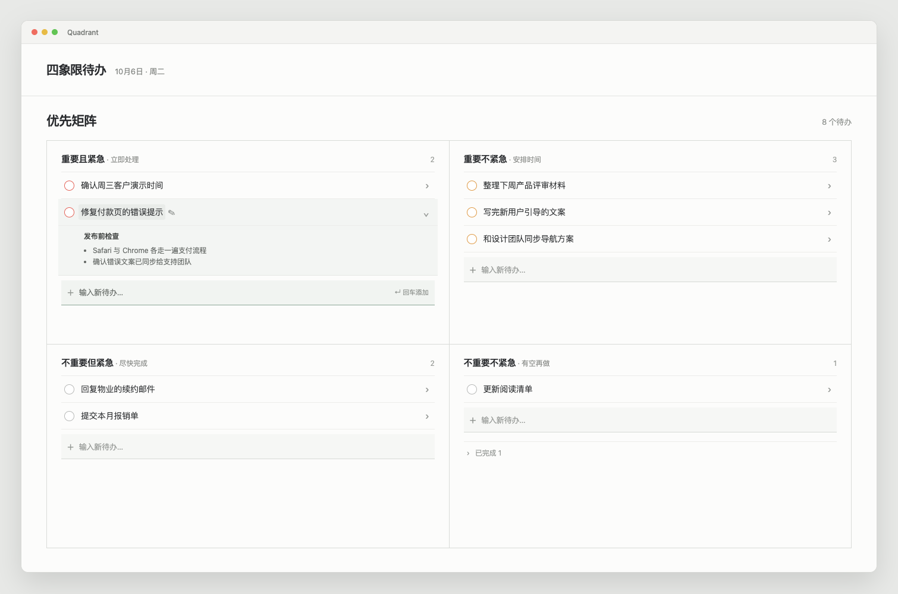

# 四象限待办 UI PRD

**版本：v1.1 · 2026-10-06**（v1.1 变更见文末）

**状态：交互规格草案，非已实现说明**

**设计参考：** 

上图用于对齐视觉密度、信息层级和状态表达，是静态设计参考，**不是运行验证截图**，也不放入 `docs/verify/`。

## 1. 范围与目标

本规格定义 QuadrantTodo 展开面板中的四象限待办主界面，覆盖事项的新建、查看 Markdown 描述、编辑、完成、删除撤销、排序及窄窗口布局。

目标：

- 宽窗口以 2×2 四象限帮助用户按重要性和紧急性处理事项。
- 让输入、完成、展开详情和编辑四类动作有稳定且互不抢占的点击区域。
- 事项描述作为可保存的 Markdown 内容，而不是子任务、进度记录或时间线。
- 保持本地持久化，并兼容既有 `note`、旧描述和旧 progress 数据迁移。

非目标：

- 不新增导航栏、搜索、筛选、截止日期、提醒、标签、协作或日历功能。
- 不把描述中的列表转换为可勾选子任务，也不显示进度百分比或活动流。
- 不以截图日期推断事项存在截止日期；日期仅为界面中的系统日期展示。

## 2. 已确认要求与本 PRD 建议默认

| 类型 | 内容 |
| --- | --- |
| 已确认 | 宽窗口为 2×2 四象限；窄窗口按 Q1、Q2、Q3、Q4 纵向排列。 |
| 已确认 | 每个象限末尾直接输入新增；完成圆圈独立；点击事项行空白处展开 Markdown。 |
| 已确认 | 单击事项标题进入编辑浮层；标题悬停显示浅底和小铅笔；不再依赖双击。 |
| 已确认 | 编辑浮层以事项名称为页面级标题，并在同一编辑外框内编辑 Markdown 描述。 |
| 已确认 | 描述支持小标题、正文、普通列表和本地附件图片；数据须本地持久化并兼容旧 notes/progress。 |
| 已确认（v1.1） | 600pt 主内容宽度是宽/窄布局断点；默认窗口 680×560 即显示 2×2，象限较窄时使用紧凑间距。 |
| 本 PRD 建议默认 | 同一时刻主面板只展开一个事项（包含已完成区），以控制四象限高度；编辑态不改变展开态。 |
| 本 PRD 建议默认 | 删除后显示短时“已删除，撤销”反馈；完成项按象限折叠。 |

除“已确认”行以外，本 PRD 的新增规则均为可执行的建议默认，用于避免实现阶段出现行为空白；不代表用户已逐项确认。

## 3. 信息架构与逻辑数据

一个事项的逻辑字段如下；字段名只描述数据语义，不约束现有 API：

| 字段 | 说明 |
| --- | --- |
| id | 稳定唯一标识。 |
| title | 逻辑上为单行事项名称；去掉首尾空白后不能为空，建议上限 200 个 Unicode 字符。 |
| quadrant | Q1 重要且紧急、Q2 重要不紧急、Q3 不重要紧急、Q4 不重要不紧急。 |
| descriptionMarkdown | 事项说明的 Markdown 原文，可为空。 |
| attachmentRefs | Markdown 图片所引用的本地附件标识。 |
| isCompleted / completedAt | 完成状态及完成时间，用于已完成折叠区排序。 |
| sortOrder / createdAt / updatedAt | 象限内排序与稳定显示所需的元数据。 |

事项标题是详情的页面级 heading。描述中的 `#`、`##` 等 Markdown heading 仅属于描述正文，不能被提取、替换或误显示为事项标题。

## 4. 主界面与布局

设计参考图中的“8 个待办”严格表示未完成事项：Q1 为 2、Q2 为 3、Q3 为 2、Q4 为 1；已完成折叠入口不计入该数字。

### 4.1 区域映射

| 区域 | 内容与行为 |
| --- | --- |
| 顶栏 | 标题“四象限待办”，次级显示系统日期；不放搜索、筛选或截止日期控件。 |
| 主标题 | “优先矩阵”及未完成事项总数。总数只统计未完成事项。 |
| 象限标题 | 象限名称、轻量行动提示和该象限未完成数。 |
| 未完成列表 | 紧凑任务行，以细分隔线分开；任务没有卡片化外壳。 |
| 新建输入行 | 每个象限末尾固定存在的单行输入框。 |
| 已完成入口 | 与未完成列表分隔，默认折叠，显示“已完成 N”。 |

### 4.2 响应式布局

| 宽度 | 布局 |
| --- | --- |
| `>= 600pt` | 2 列 × 2 行：Q1 左上、Q2 右上、Q3 左下、Q4 右下。 |
| `< 600pt` | 单列纵排：Q1、Q2、Q3、Q4。窗口主体纵向滚动，每个象限内部不强制独立滚动。 |

600pt 按**主内容可用宽度**计算，而非整个屏幕宽度。跨过断点时保留当前输入草稿、输入焦点、编辑草稿和展开状态；不因布局切换重建状态。宽版整体可纵向滚动，两行高度随其内容增长，不能因展开描述遮挡输入行或下方象限。

长标题在任务行中单行截断，保留可访问名称的完整文本；编辑浮层的标题输入可视觉软换行以便阅读，但 Enter 不写入换行。粘贴的换行统一转换为空格，超出 200 字符时阻止继续输入或明确提示，不能静默截断。窄窗口中输入行、完成圆圈与展开箭头必须保持可点按，不可被截断文本覆盖。

## 5. 任务行事件与优先级

任务行从左至右包含独立完成圆圈、标题区域、行空白/展开箭头；在标题悬停或键盘聚焦时显示浅底和紧贴文字的小铅笔。

事件优先级（从高到低）：

1. 描述内链接、图片预览、文本选区、附件控制：执行其原本行为，不触发行展开或编辑。
2. 完成圆圈：只切换完成状态。
3. 标题及紧贴铅笔：打开编辑浮层。
4. 行尾展开箭头和标题外的行空白：展开或收起描述。
5. 独立拖拽把手，或满足拖拽阈值的行空白：进入拖拽；标题文字、输入框和描述选文不得发起拖拽。

单击不依赖双击。双击标题等同一次标题编辑动作，不能在一次双击中既展开又重复打开编辑浮层。

### 5.1 展开 Markdown

- 点击空白或箭头后，在该行下方以内嵌正文展示 `descriptionMarkdown` 的渲染结果；无描述时展开“暂无描述”，而不是切换后无视觉反馈。
- 普通 `-` / `*` / 有序列表必须是普通文本列表，不能出现完成圆圈、进度计数或子任务状态。
- 显式 Markdown 任务列表（`- [ ]` / `- [x]` / `- [X]`）渲染为未勾选 / 已勾选方框，仅展示原文状态；不生成子任务，不影响事项完成状态或计数，修改状态仍通过编辑 Markdown 保存。
- 本地图片按 Markdown 引用渲染；缺失附件显示可读的占位错误，不阻塞其他文本。
- 本 PRD 建议默认：展开新事项前自动收起另一事项；再次点击当前事项收起。
- 展开描述后选中正文文本、点击链接或操作图片时，不得反向触发行点击。

### 5.2 完成与已完成区

- 点击圆圈提交完成状态切换；圆圈是唯一完成入口，标题或空白点击不完成事项。保存成功前保持原状态。
- 完成操作进入临时 pending 状态并禁用重复点击；仅在本地保存成功后，事项才从未完成列表移入所属象限的“已完成 N”折叠区，并按完成时间倒序。
- 打开已完成区后，标题仍可编辑、行空白仍可展开阅读；可再次点击圆圈恢复未完成。建议默认恢复事项追加到该象限未完成列表末尾。
- 完成、恢复都必须本地保存；保存失败时取消 pending 并维持原列表、计数和完成状态。
- 完成成功后显示 5 秒「已完成「标题」 · 撤销」，撤销把事项放回原象限的原排序位置；从已完成区恢复未完成的结果肉眼可见，不再提示。

### 5.3 删除与撤销

- 编辑浮层内提供删除动作，避免在紧凑行上误删。
- 建议默认删除后显示 8 秒“已删除，撤销”；在撤销窗口内恢复原事项、描述、附件引用、象限和原排序位置。
- 连续删除使用可逐项撤销的队列，最新删除优先展示；撤销一个项目不丢弃先前项目的剩余撤销机会。
- 删除不自动删除实体图片文件，以免共享引用或旧数据丢失；附件垃圾回收不属于本次范围。旧 progress 关联的清理仅可在不影响撤销和迁移完整性的前提下进行。

## 6. 象限尾部直接输入

每个象限末尾始终有输入行，placeholder 为“输入新待办…”（空象限为“这个象限还没有待办，直接输入…”，不再另显示空态文字）。平时只显示浅色提示，悬停或获得焦点时才出现浅底色与细底线。点击输入行任意位置即获得焦点，不需要先点“+”按钮。

| 情况 | 行为 |
| --- | --- |
| 输入文本后按 Enter | 保存成功后，在该象限未完成列表末尾创建事项、清空输入内容并更新计数；输入框持续保持焦点，可连续录入。 |
| 空白或仅空格后 Enter | 不创建事项；保留焦点并显示轻量校验提示。 |
| 中文 IME 组合输入时 Enter | 若 IME 仍在候选确认阶段，只确认候选，不能提交事项。仅组合结束后的提交 Enter 创建。 |
| 标题过长 | 本 PRD 建议默认：限制为单行，并在保存时执行统一长度上限与首尾去空白。 |
| 同名标题 | 允许重复，分别创建独立事项。 |
| 本地保存失败 | 保留输入文本与焦点，显示可重试错误；不得假装创建成功。 |

创建成功后，新事项按“追加末尾”的建议默认出现；列表变化本身就是反馈，不再弹成功提示。保存未成功前不得清空文本、改变计数或显示新事项。输入框不解析未确认的优先级、日期或标签语法。提交期间仅锁定当前输入行，防止连按 Enter 重复创建；其他象限仍可操作。同名事项允许通过两次独立的成功提交创建。

## 7. 编辑浮层

### 7.1 打开和结构

单击标题或紧贴标题的铅笔打开编辑浮层。浮层只有一个编辑外框：顶部是可编辑的事项名称（页面级 heading），下方是可编辑的 Markdown 描述；二者属于同一事项保存上下文。象限选择可作为事项属性控件置于浮层内。

编辑器支持小标题、正文、普通列表以及插入本地图片引用。图片写入本地附件存储后，在 Markdown 中插入对应引用。描述不能自动拆成 subtasks、checklists、progress entries 或 timeline。

### 7.2 保存、取消和离开

| 触发 | 无修改 | 有修改（dirty） |
| --- | --- | --- |
| 保存 | 校验标题后关闭。 | 保存 title、description、象限和附件引用；成功后关闭。保存期间禁用重复提交。 |
| 取消 | 关闭。 | 与其他离开路径一致，弹出保存 / 放弃 / 继续编辑。 |
| Esc、外部点击、关闭按钮、切换到另一事项 | 关闭。 | 弹出一致的确认：保存 / 放弃 / 继续编辑。 |
| 保存失败 | 保留浮层。 | 保留全部草稿和焦点，提示失败且允许重试。 |

标题为空时禁止保存，并将焦点定位至标题。保存不得丢失尚未写入的 Markdown 文本或图片引用。本 PRD 统一采用明确的“保存”按钮，不采用自动保存；保存失败不关闭浮层。重开编辑时必须只显示最近一次成功保存的数据。

## 8. 排序、跨象限与拖拽

- 从独立拖拽把手开始；若使用行空白开始拖拽，建议经过 6px 移动阈值后才启动，避免单击展开被误识别。
- 标题文本、铅笔、完成圆圈、展开箭头、输入行、Markdown 链接、图片和文本选区都不抢拖拽。
- 同象限拖拽调整未完成事项顺序；跨象限放置时更新 `quadrant`，并插入目标位置。
- 拖拽中显示清晰插入位置；失败或取消时恢复原象限和排序。鼠标抬起后抑制同一次拖拽产生的 click；输入框永不触发拖拽。
- 为键盘用户提供等价的“移至象限”和“上移/下移”操作入口；这些操作与拖拽同样保存并可在失败时恢复。
- 已完成区默认不支持拖拽排序；先恢复未完成后才能移动。

## 9. 键盘与可访问性

- Tab 按视觉 DOM 顺序：Q1 到 Q4；每象限中未完成任务行及其完成/编辑/展开入口在输入行之前，已完成入口在输入行之后；不把纯装饰文字放入焦点序列。
- 完成按钮、标题编辑、展开按钮、删除和撤销均有清晰可访问名称与状态（例如“展开描述”“收起描述”）。
- 在新建输入框中 Enter 提交，Escape 统一清空当前未提交草稿并保持焦点，不删除事项。
- 编辑浮层打开后焦点进入标题；Esc 走第 7.2 节的统一离开流程；焦点不能落到遮罩后的主界面；关闭后回到原事项的标题入口，若事项已删除则回到所属象限的新增输入框。
- 颜色不是唯一状态表达：完成、展开、校验和保存失败需有文字、图标或 accessibility state。

## 10. 加载、空态与错误

| 状态 | 表现 |
| --- | --- |
| 加载中 | 保留四象限结构，用简洁骨架行或加载文字；输入不可提交。 |
| 某象限为空 | 显示输入行及简短空态，不伪造任务。 |
| 所有象限为空 | 标题和四象限仍可见，方便从任一象限直接输入。 |
| Markdown / 图片读取失败 | 在该描述位置提示读取失败，任务标题、其他事项和编辑入口仍可用。 |
| 磁盘保存失败 | 保留未提交输入或编辑草稿；显示可见错误及重试路径，不更新成功计数或完成状态。 |

所有事项变更均以本地写入成功作为成功条件。重启后恢复事项名称、Markdown 原文、象限、完成状态、排序和有效附件引用。旧 notes/progress 的迁移须可重复执行而不重复追加内容；迁移成功前保留原始数据，失败时不得覆盖或清空原始内容。旧标题超过新建议上限时不得在加载或迁移时截断。

全新且从未初始化的空数据目录首次启动只创建 4 条示例，四个象限各一条，其中 1 条已完成。示例初始化最多成功一次；已有数据升级、用户主动清空或初始化写入失败时，不得删除、覆盖或为了补足数量而修改用户事项。升级应用包与源码必须保留数据库和附件，并在替换旧应用前备份现有数据。

## 11. 验收场景（Given / When / Then）

| Given | When | Then |
| --- | --- | --- |
| 宽度为 1100px | 打开主界面 | Q1/Q2 在上行，Q3/Q4 在下行。 |
| 宽度为 700px | 打开主界面 | Q1、Q2、Q3、Q4 纵向排列，可整体滚动。 |
| 可用主内容宽度从 600pt 改为 599pt | 窗口连续缩窄 | 切至纵排，但输入草稿、焦点及展开状态保持。 |
| Q2 输入行为空 | 点击其任意位置并输入“整理材料”，按 Enter | 创建 Q2 事项，输入框清空且继续聚焦。 |
| 中文 IME 正在选择候选 | 按 Enter | 仅确认候选，不创建事项。 |
| 输入只有空格 | 按 Enter | 不创建事项，保持焦点并显示校验。 |
| Q1 标题处于悬停 | 单击标题或铅笔 | 仅打开编辑浮层；不展开描述。 |
| 行尾箭头或标题外空白 | 单击 | 仅展开/收起该事项的 Markdown。 |
| 描述正文正在选文 | 拖动选择或点击链接 | 不展开、不编辑、不拖拽。 |
| 已展开一个事项 | 展开另一个事项 | 建议默认下，前者收起，后者展开。 |
| 点击完成圆圈 | 保存成功 | 事项移入该象限的“已完成 N”；未完成总数减少。 |
| 点击完成圆圈 | 保存失败 | 取消 pending，事项、计数和圆圈状态保持原样。 |
| 点击已完成事项圆圈 | 保存成功 | 事项回到原象限未完成列表。 |
| 删除事项 | 在撤销窗口点撤销 | 原 title、Markdown、附件引用、象限和排序恢复。 |
| 编辑草稿已修改 | 按 Esc 或点遮罩 | 出现保存/放弃/继续编辑，任何选择都不静默丢失草稿。 |
| 编辑草稿已修改 | 点击取消 | 同样出现保存/放弃/继续编辑。 |
| 本地保存失败 | 新建、完成或编辑保存 | 草稿或原状态保留，显示失败并可重试。 |
| 双击标题 | 快速连续点击 | 不创建两个编辑层，也不额外触发展开。 |
| 重启应用 | 重新打开主界面 | 最近成功保存的 title、描述、完成状态、排序、旧 note/progress 无损迁移结果及本地图片引用均可读。 |

## 12. 与现有实现的衔接

现有代码已经具备任务的本地持久化、未完成/已完成分组排序、完成切换、删除撤销、描述 Markdown 渲染、本地图片附件、旧 progress 向描述迁移等基础。现有主行仍把“单击展开、双击编辑”作为行为，因此本 PRD 是后续改造的交互目标，尤其需要替换双击编辑入口、收紧事件命中区，以及补齐输入失败与 dirty 离开确认的一致性。本次仅完成文档和静态设计参考复查，尚未进行实际功能测试。

官方界面研究仅用于视觉密度和输入模式参考：[Todoist](https://www.todoist.com/)、[Things](https://culturedcode.com/things/index.html)、[TickTick](https://ticktick.com/features)、[Microsoft To Do 的新建/编辑任务说明](https://support.microsoft.com/en-us/todo/create-edit-delete-and-restore-tasks)。

## 13. v1.1 变更（2026-10-06，用户确认）

在“简洁好用”的前提下做减法，不新增功能：

- **默认即四象限**：断点由 900 改为 600（主内容宽度），默认窗口 680×560，窄象限使用紧凑间距；尺寸预设为紧凑 420×320 / 默认 680×560 / 宽松 960×680。
- **一行顶栏**：「优先矩阵 · 日期 …… N 个待办 · 收起」，不再分两行显示「四象限待办」与「优先矩阵」。
- **完成可撤销**：见 5.2。
- **输入行变轻、空态合并**：见第 6 节。
- **减少视觉噪音**：象限标题前加象限色圆点；「已完成 N」去掉上方分隔线并使用更浅字色；行尾箭头仅在有描述的事项常显（替代原描述图标），其余事项悬停时出现；悬停行首出现拖拽把手。
- **减少提示**：新建、编辑保存成功不再提示；保留失败提示与完成后的撤销提示。
- **快捷键落点可见**：全局快捷键 / ⌘N 聚焦输入行时，目标象限短暂高亮。
- **编辑浮层默认预览**：已有描述时先显示渲染结果，单击正文进入编辑；无描述时直接编辑。
- **收起更宽容**：鼠标移出面板 0.5 秒后收起；展开描述、保存完成中或有撤销提示时为 1.5 秒。
